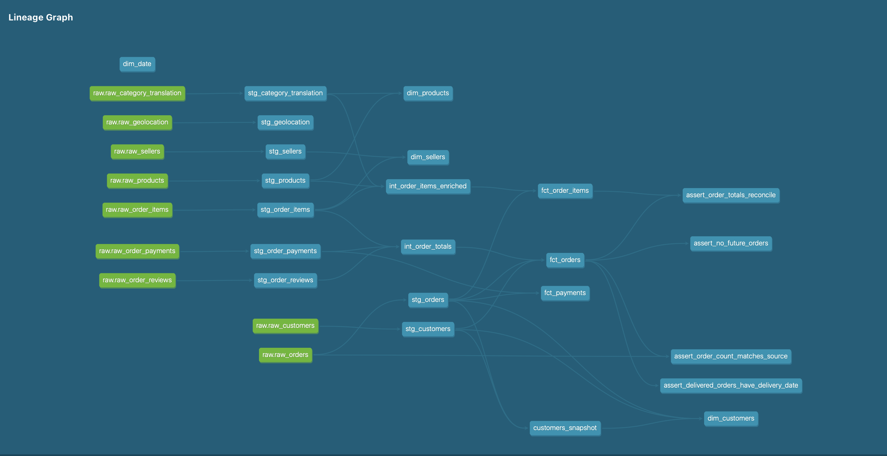
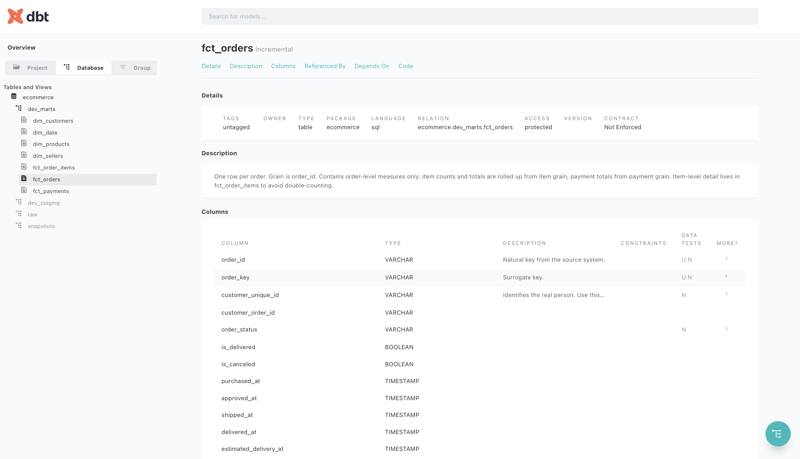

# E-commerce Analytics Platform

A production-style analytics engineering project: PySpark ingestion into a dimensional model built with dbt, orchestrated in Airflow and tested in CI.

Built on the [Olist Brazilian E-Commerce dataset](https://www.kaggle.com/datasets/olistbr/brazilian-ecommerce) — ~100,000 real orders across 9 source tables.

**Stack:** dbt · SQL · PySpark · DuckDB · Airflow · GitHub Actions

---

## Architecture

```
  Source CSVs (9 files)
          │
          ▼
  PySpark ingestion  ──── logs row counts per table
          │
          ▼
  DuckDB · raw schema
          │
  ┌───────┴──────────────────────────────────────┐
  │                   dbt                        │
  │                                              │
  │  staging (9 views)      one model per source │
  │       │                 rename, cast, clean  │
  │       ▼                                      │
  │  intermediate           reusable joins,      │
  │  (ephemeral)            pre-aggregation      │
  │       │                                      │
  │       ▼                                      │
  │  marts (7 tables)       star schema          │
  │                                              │
  │  snapshots              SCD Type 2 history   │
  └──────────────────────────────────────────────┘
          │
          ▼
  Airflow DAG (daily)  ·  GitHub Actions on every PR
```



---

## The data model

Three fact tables at **three distinct grains**, with conformed dimensions.

| Model             | Grain                                 | Materialization                  |
| ----------------- | ------------------------------------- | -------------------------------- |
| `fct_orders`      | One row per order                     | **incremental** (7-day lookback) |
| `fct_order_items` | One row per item line within an order | table                            |
| `fct_payments`    | One row per payment transaction       | table                            |
| `dim_customers`   | One row per customer **version**      | **SCD Type 2**                   |
| `dim_products`    | One row per product                   | table                            |
| `dim_sellers`     | One row per seller                    | table                            |
| `dim_date`        | One row per calendar date             | table                            |

### Why three fact tables

An order has many items and may have many payments. Combining them into one table would repeat `order_total` on every row, and any `SUM(order_total)` would multiply revenue by the item count.

Each measure lives at the grain where it is valid:

- `order_total`, `item_count`, `payment_total` → **order grain** only
- `item_price`, `freight_value` → **item grain** only
- `payment_value`, `payment_installments` → **payment grain** only

A reconciliation test asserts that `items_total` on `fct_orders` equals the sum of `item_price` in `fct_order_items` for every order, so the two grains cannot silently diverge.

---

## Design decisions

### The `customer_id` trap

In the Olist source, `customer_id` is unique **per order**, not per person. `raw_customers` and `raw_orders` both have exactly 99,441 rows.

A model keyed on `customer_id` would treat every order as a new customer, making repeat-purchase and lifetime-value analysis impossible.

`customer_unique_id` is the real person identifier. It is carried through to `fct_orders` and is the key for `dim_customers`, and the trap is documented in the source YAML where the next person will see it.

### SCD Type 2 customer history

Customers move. The source only holds current state, so historical orders would report against the customer's present-day city.

`dim_customers` is built from a dbt snapshot using the `check` strategy on city, state and zip prefix — Olist has no reliable `updated_at` column, so value comparison is the only option available.

The surrogate key is built from `customer_unique_id` + `dbt_valid_from`, because the natural key is no longer unique once a customer has multiple versions.

```sql
-- current view
select * from dim_customers where is_current

-- point-in-time: the customer as they were when the order was placed
select o.order_id, o.order_date, c.customer_state
from fct_orders o
join dim_customers c
  on o.customer_unique_id = c.customer_unique_id
 and o.purchased_at >= c.valid_from
 and o.purchased_at <  coalesce(c.valid_to, timestamp '9999-12-31')
```

### Incremental with a lookback window

`fct_orders` is incremental, but filtering on "strictly newer than my maximum" would be wrong here. Orders are **updated after purchase** — approval, shipping and delivery timestamps all arrive days later.

A 7-day lookback reprocesses a window rather than only new rows, so those updates are captured. Combined with `unique_key`, reruns update in place rather than duplicating, which makes the model idempotent.

```sql

where purchased_at >= (
    select max(purchased_at) - interval 7 day from {{ this }}
)

```

### Geolocation aggregated in staging

`stg_geolocation` is a deliberate exception to the "no aggregation in staging" rule. The source has ~1M rows with many coordinates per zip prefix; joining it raw would fan out any downstream model. It is collapsed to one representative point per prefix, and the reason is documented on the model.

### Unknown categories bucketed, not dropped

Some products have no category, and some Portuguese categories have no English translation. These are coalesced to `'Unknown'` rather than left as NULL, so they still appear in grouped reports and revenue totals stay correct.

---

## Testing

**105 tests** across four layers.

| Layer              | What it checks                                                                                                 |
| ------------------ | -------------------------------------------------------------------------------------------------------------- |
| **Source tests**   | Primary keys unique and not null, status values within an accepted set — failures caught before transformation |
| **Schema tests**   | `unique`, `not_null`, `relationships`, `accepted_values` on every model                                        |
| **Grain tests**    | `dbt_utils.unique_combination_of_columns` on every composite-grain table                                       |
| **Reconciliation** | Source-to-mart row counts, and cross-grain total agreement                                                     |

Referential integrity is enforced with `relationships` tests: every order item points at a real order, product and seller.

### A known data quality issue

`assert_delivered_orders_have_delivery_date` finds **8 orders** (0.008%) marked `delivered` with no delivery timestamp.

The test is set to `severity: warn` rather than removed. The volume is immaterial and the defect originates upstream, so failing the pipeline would cost more than it protects — but keeping the test means the count is visible on every run, and a regression at source would be caught immediately.



---

## Running it

### Prerequisites

Python 3.11 (3.12+ is not yet supported by all dependencies).

### Setup

```bash
git clone https://github.com/Vineela-Yenigandla/ecommerce-analytics.git
cd ecommerce-analytics

python3.11 -m venv venv
source venv/bin/activate          # Windows: venv\Scripts\activate
pip install -r requirements.txt
```

### Get the data

Download the [Olist dataset from Kaggle](https://www.kaggle.com/datasets/olistbr/brazilian-ecommerce) and unzip the 9 CSVs into `data/raw/`.

Or generate a synthetic sample with the same shape — no Kaggle account needed:

```bash
python ingestion/generate_sample.py
```

### Configure dbt

Add to `~/.dbt/profiles.yml`:

```yaml
ecommerce:
  target: dev
  outputs:
    dev:
      type: duckdb
      path: ../../ecommerce.duckdb
      schema: dev
      threads: 4
    prod:
      type: duckdb
      path: ../../ecommerce.duckdb
      schema: prod
      threads: 8
```

### Build

```bash
python ingestion/load_raw.py       # ingest 1.55M rows into raw

cd dbt/ecommerce
dbt deps
dbt debug                          # verify connection
dbt snapshot                       # build SCD2 history first
dbt build                          # build and test everything
dbt docs generate && dbt docs serve
```

---

## Project structure

```
ecommerce-analytics/
├── ingestion/
│   ├── load_raw.py             PySpark ingestion, idempotent
│   └── generate_sample.py      Synthetic fixtures for CI
├── dbt/ecommerce/
│   ├── models/
│   │   ├── staging/            9 models — clean one source each
│   │   ├── intermediate/       Ephemeral joins and pre-aggregation
│   │   └── marts/              3 facts, 4 dimensions
│   ├── snapshots/              SCD Type 2 customer history
│   ├── macros/                 Reusable cleaning logic
│   └── tests/                  Reconciliation and business rules
├── airflow/dags/               Daily orchestration
├── .github/workflows/          dbt build on every pull request
└── docs/                       Lineage and model documentation
```

---

## Engineering practice

**Two environments.** `dev` and `prod` targets build into separate schemas from identical code — `ref()` resolves the schema at compile time, so dev can be broken freely.

**DRY.** Repeated cleaning logic lives in macros. When `initcap` turned out not to exist in DuckDB, four broken models were fixed by editing one file.

**Idempotent by design.** `CREATE OR REPLACE` in ingestion, `unique_key` on the incremental model. Every stage can be rerun safely, which is what makes retries and backfills possible.

**CI on every pull request.** GitHub Actions installs dependencies, generates synthetic data, runs the ingestion and executes `dbt build`. Because the real dataset cannot be committed, CI uses fixtures with the same shape — the standard answer to testing a pipeline without shipping its data.

**Documented where it matters.** Every model carries a description, every fact table states its grain, and non-obvious decisions are explained in the model file rather than in tribal knowledge.

**Pinned dependencies.** `requirements.txt` pins exact versions. The latest dbt release fails to build on some Python versions; pinning means the project builds identically on any machine and in CI.
